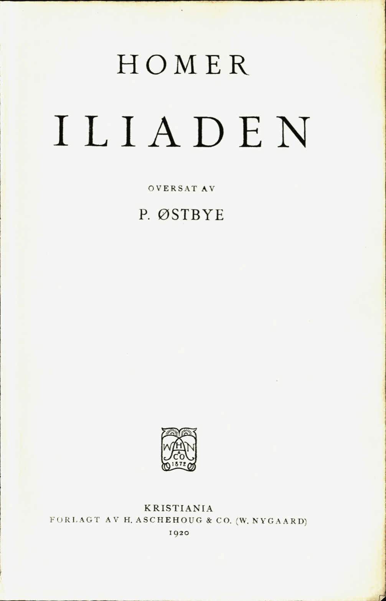

---
title:
- type: main
  text: Iliaden
creator:
- role: author
  text: Homer
- role: translator
  text: P. Østbye
contributor:
- role: book designer
  text: Martin Mihle Nygaard (ebok)
lang: no-nb
date: 1920
rights:  Allemannseie
cover-image: bilder/cover.png
...

# Iliaden. {epub:type=title}

*Til leseren av eboken,*

Denne digitale utgaven er lagd etter Nasjonalbibliotekets skann av
førsteutgaven av P. Østbyes oversettelse fra 1920. Teksten er etter beste evne
transkribert tegn for tegn fra orginalen. Oversettelsen, og denne eboken,
tilfaller allmannseie, og kan deles og endres fritt.

—[M.M.]{.smallcaps}

